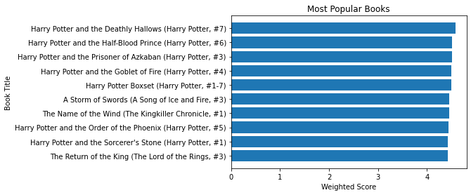
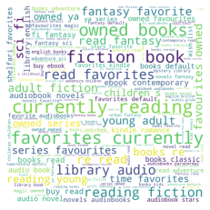

# Why Do Websites Know Me So Well?

## Book Recommendation System
Author: Mikhaela Martin

### Introduction
We will be exploring three recommendation techniques that top companies such as Netflix, Google, and Amazon incorporate in their models. In this application, we will use the GoodReads-10K dataset to recommend books based on user input.

1. Weighted-Scoring/Popularity-Based:

    All books receive a score from 1 to 5 that takes into account their average rating and number of ratings given. Books that have a higher score are deemed more "popular" and are more likely to be recommended to the user.

2. Content-Based Filtering:

    The system heavily relies on item attributes such as book summary, author, tags, date published, etc. to recommend books similar to ones the user has read already. 

3. Collaborative Filtering:

    This method is based on the belief that people like things that are similar to what they already like and things that people who are similar to them also like. There are a couple types of collaborative filtering and methods to go about implementing it, but we will delve into it later on.

### Data
[GoodReads-10K](https://www.kaggle.com/zygmunt/goodbooks-10k)

### Methods

1. Weighted-Scoring/Popularity-Based Filtering
2. Content-Based Filtering: TFIDFVectorizor, Cosine Similarity, Cosine Distance
3. Collaborative Filtering: KNearest Neighbors, Matrix Factorization (SVD)

#### The Harry Potter Series are the Most Popular Books

Popularity-Based Filtering Suggestions

#### People Tag Books They Read and Liked

Most Common Words in Descriptions. Used for Content-Based Filtering

### For further information
Visit my personal website! 
https://mikhaela-martin-blogs.ghost.io/ghost/#/dashboard
View my other projects!

